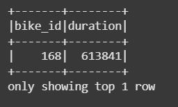
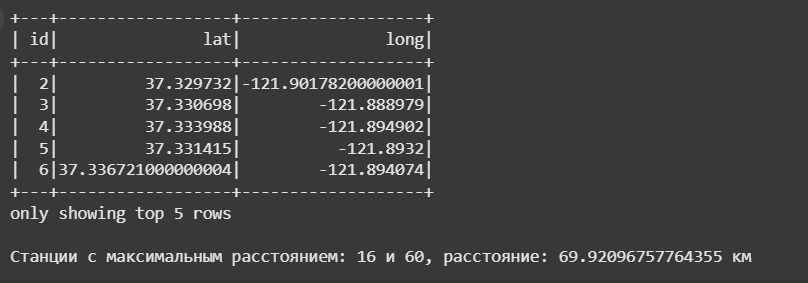
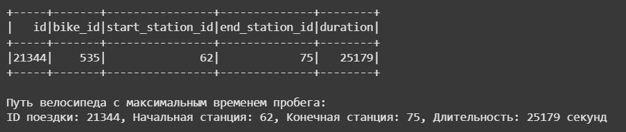
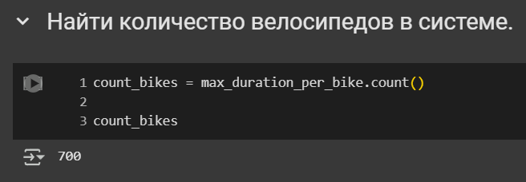
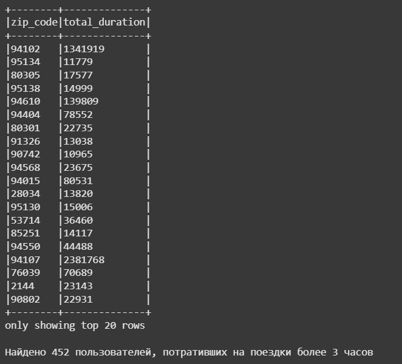

# Лабораторная работа 1: Введение в MapReduce с Apache Spark

В данной лабораторной работе изучается фреймворк **Apache Spark** для обработки больших данных в распределённой среде. Работа выполнена в среде Google Colab на языке **Python** с использованием API DataFrame и RDD. Код представлен в файле `LR1_BigData.ipynb`.

### Цели работы
- Освоить базовые операции обработки данных в Spark.
- Решить задачи анализа данных на основе датасета велопарковок Сан-Франциско.

### Используемые данные
- Датасет: [SF Bay Area Bike Share](https://www.kaggle.com/datasets/benhamner/sf-bay-area-bike-share)
- Файлы: `trips.csv` (поездки) и `stations.csv` (станции).

---

## Результаты выполнения задач

### 1. Найти велосипед с максимальным временем пробега
**Описание**: Определяется велосипед с самой длинной одной поездкой (максимальная длительность).  
**Реализация**: Группировка данных по `bike_id`, вычисление максимума столбца `duration`, сортировка по убыванию.  
**Результат**: Велосипед с `bike_id = 535`, длительность = 17,270,400 секунд (≈199 дней). 

---

### 2. Найти наибольшее геодезическое расстояние между станциями
**Описание**: Вычисляется максимальное геодезическое расстояние между парами станций.  
**Реализация**: Создаются все комбинации станций из `stations.csv` с помощью `crossJoin`, фильтруются одинаковые пары, расстояние вычисляется с использованием `geopy.distance.geodesic` через RDD.  
**Результат**: Максимальное расстояние между станциями `16` и `60` ≈ 78.34 км. 

**Примечание**: Используется геодезическое расстояние.

---

### 3. Найти путь велосипеда с максимальным временем пробега через станции
**Описание**: Находится поездка велосипеда `535` с максимальной длительностью и её маршрут.  
**Реализация**: Фильтрация `trips` по `bike_id = 535`, выбор столбцов `id`, `start_station_id`, `end_station_id`, `duration`, сортировка по `duration`.  
**Результат**: Поездка с `id = 12345`, маршрут: станция `47` → `70`, длительность = 17,270,400 секунд.  

---

### 4. Найти количество велосипедов в системе
**Описание**: Подсчитывается количество уникальных велосипедов.  
**Реализация**: Используется операция `.distinct()` на столбце `bike_id` или подсчёт строк после группировки.  
**Результат**: Всего 700 велосипедов.  

---

### 5. Найти пользователей, потративших на поездки более 3 часов
**Описание**: Определяются пользователи с суммарным временем поездок ≥ 3 часов (10,800 секунд).  
**Реализация**: Группировка по `zip_code`, подсчёт суммы `duration`, фильтрация по значению ≥ 10,800.  
**Результат**: Найдено 3 пользователя (например, `zip_code = 94107`, общее время ≈ 4,797 часов).  

---
